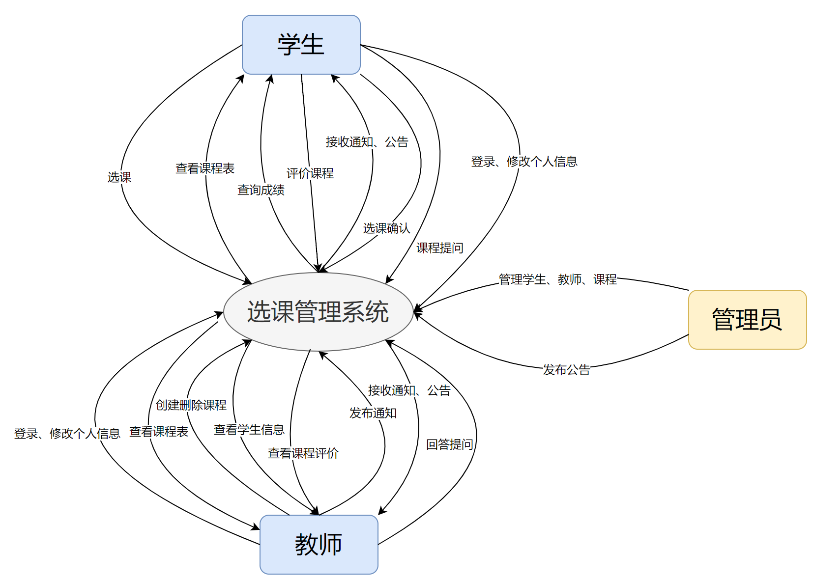
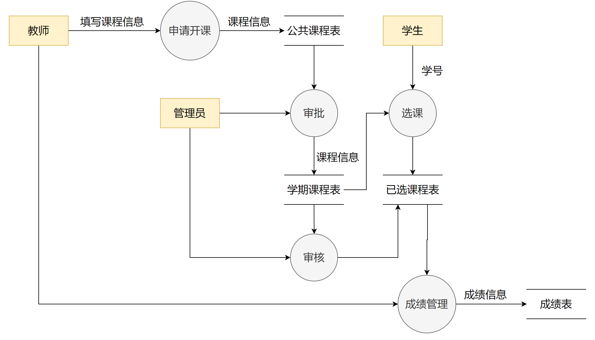
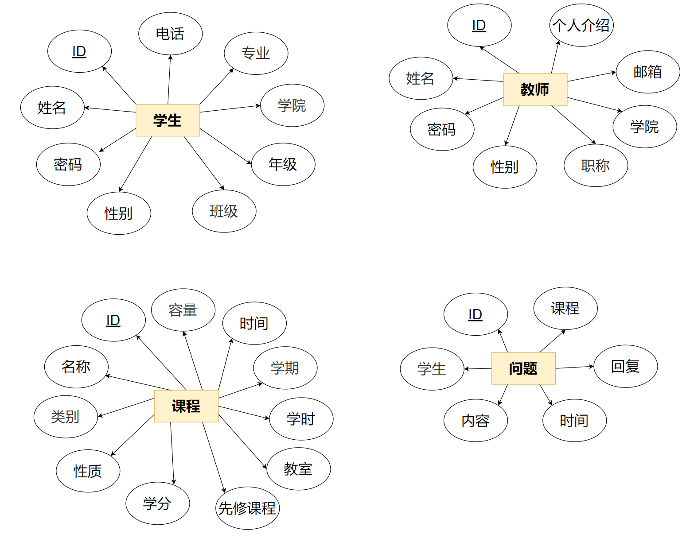
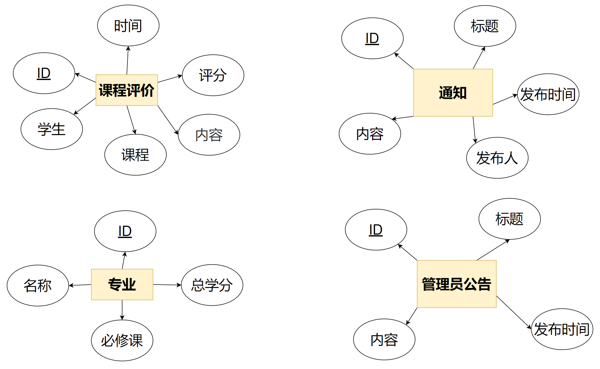
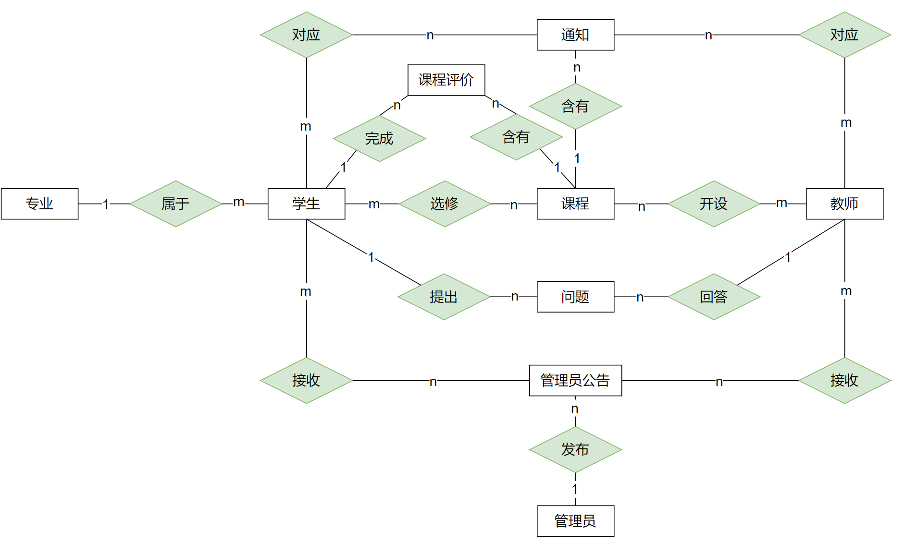

# 学生选课管理系统

### 1. 项目说明

本项目旨在开发一个基于 Web 的高校学生选课管理系统，为学生、教师和教务管理人员提供便捷、有效的选课和课程管理平台。随着学分制的推广和教育改革的深化，选课机制的复杂性和管理难度显著增加。高效、便捷的选课管理系统可以极大地提升学生的自主选课体验，并提高学校教学管理的效率。

系统功能涵盖学生选课、课程查询、成绩查询、教师课程管理等模块。学生可以自主选择符合培养计划的课程，实时查看已选课程和成绩；教师则可管理自己所授课程的选课人数和成绩录入，确保教学资源的合理分配。系统还支持教务人员进行课程信息管理和数据统计分析，以实现对教学资源的动态优化。

本系统的设计着眼于操作便捷和数据处理效率，具备良好的用户交互界面，并采用数据库管理学生、课程和成绩等核心数据，确保数据的准确性和一致性。通过该系统，学生能够更好地规划个人学习进度，教师与教务人员则可以实现精确、快速的管理和决策，最终提升教学质量和管理效益。

### 2. 需求及功能设计

#### 学生

1. 选课，根据教师姓名、学院等信息筛选，可以查看老师信息、支持系统检测选课时间、容量、教室冲突。
2. 管理自己的课程表。
3. 可以查询已修课程和成绩，查看已修学分进度。
4. 选课时可以查看课程所有评价。在查询成绩前，学生需要对已修课程进行打分和反馈（前端匿名），为其他同学选择课程提供更多参考。
5. 具有查询课程信息和课程公告的权限。学生可以查看与自己相关的通知，确保能够及时获取课程相关的重要信息。
6. 向老师提问课程相关问题，并自动通知老师。
7. 选课确认，系统检查满足专业所有必修课程要求方可确认课表。
8. 修改个人信息。

#### 教师

1. 创建课程，录入课程介绍、选课容量等信息，创建、修改、删除课程需要经过管理员同意。
2. 管理自己所教的课程表。
3. 可以录入和更新学生的课程成绩，查看学生信息。
4. 可以查询自己所教课程的学生名单信息和成绩。
5. 查看学生对课程的评价，了解学生的学习反馈，可根据反馈改进教学。
6. 发布课程通知，查看自己已发布的通知。
7. 回答学生对课程提问，并自动通知学生。
8. 修改个人信息。

#### 管理员

1. 具有管理学生、教师、课程的权限，可以检索，修改，增加，删除所有信息。
2. 支持按班级、年级等条件查询学生信息，按职称、姓名等条件查询教师信息，对课程关联相应的授课教师。
3. 可以查看每个课程的学生成绩，不允许修改。
4. 发布系统平台通知。
5. 重置学生、教师密码。

### 3. 数据流图

#### 顶层数据流图

#### 选课数据流图

### 4. E-R 图（概念模式）

#### 实体 E-R 图

#### 系统 E-R 图

### 5. 关系模式（逻辑模式）

#### 实体

1. **学生（Student）**

   <u>学生编号（Student_ID）</u>、密码（Password）、姓名（Name）、性别（Gender）、年级（Grade）、班级（Class_ID）、电话（Phone）、专业编号（Major_ID）、学院（College）

2. **教师（Teacher）**

   <u>教师编号（Teacher_ID）</u>、密码（Password）、姓名（Name）、性别（Gender）、职称（Title）、学院（College）、邮箱（Email）、个人介绍（Personal_Introduction）

3. **课程（Course）**

   <u>课程编号（Course_ID）</u>、课程名称（Course_Name）、学分（Credits）、先修课程编号（Pre_Course_ID）、容量（Capacity）、性质（Type）（必修 C / 选修 E）、类别（Category）（一般专业 / 核心专业 / 核心通识 / 一般通识）（General Major/Core Major/Core General/General）、学期（Semester）、时间（Date）（星期xx-1, 2节）、学时（Hours）、教室（Classroom）

4. **专业（Major）**

   <u>专业编号（Major_ID）</u>、专业名称（Major_Name）、必修课编号（Required_Course_ID）、总学分要求（Total_Credits）

5. **课程评价（Review）**

   <u>评价编号（Review_ID）</u>、学生编号（Student_ID）、课程编号（Course_ID）、评价内容（Review_Content）、评价评分（Rating）、评价时间（Review_Date）

6. **通知（Notice）**

   <u>通知编号（Notice_ID）</u>、通知标题（Title）、通知内容（Content）、发布人（Sender_ID）、通知发布时间（Publish_Date）

7. **管理员公告（Announcement）**

   <u>公告编号（Announcement_ID）</u>、公告标题（Title）、公告内容（Content）、公告发布时间（Publish_Date）

   **几个管理员？若只有一个，发布人可省略**

8. **问题（Question）（提问、回答后自动生成通知）**

   <u>问题编号（Question_ID）</u>、学生编号（Student_ID）、课程编号（Course_ID）、提问内容（Content）、提问时间（Date）、教师回复（Answer）

   

#### 联系

学生-课程

<u>学生编号（Student_ID）、课程编号（Course_ID）</u>、成绩（Grade）

教师-课程

<u>教师编号（Teacher_ID）、课程编号（Course_ID）</u>

学生-通知（老师回答后通知）

<u>通知编号（Notice_ID）</u>、学生编号（Student_ID）

教师-通知（学生提问后通知）

<u>通知编号（Notice_ID）</u>、教师编号（Teacher_ID）

课程-通知（老师发布课程通知）

<u>通知编号（Notice_ID）</u>、课程编号（Course_ID）

**通知需不需要加上已读、未读标记？**

**如果管理员公告一定给所有人发，则不需要学生-管理员公告、教师-管理员公告记录的表**？

| 联系                                    | 联系类型 |
| :-------------------------------------- | :------: |
| 学生-专业（Student-Major）              |  多对一  |
| 学生-课程（Student-Course）             |  多对多  |
| 教师-课程（Teacher-Course）             |  多对多  |
| 学生-评价（Student-Review）             |  一对多  |
| 课程-评价（Course-Review）              |  一对多  |
| 学生-问题（Student-Question）           |  一对多  |
| 教师-问题（Teacher-Question）           |  一对多  |
| 学生-通知（Student-Notice）             |  多对多  |
| 教师-通知（Teacher-Notice）             |  多对多  |
| 课程-通知（Course-Notice）              |  一对多  |
| 管理员-管理员公告（Admin-Announcement） |  一对多  |
| 学生-管理员公告（Student-Announcement） |  多对多  |
| 教师-管理员公告（Teacher-Announcement） |  多对多  |

## 安全性控制

多角色登录（学生，教师，管理员）

权限等级：管理员 > 教师 > 学生

权限控制：教师和学生只能看到自己相关课程信息，管理员只能审批课程修改信息，不能直接修改学生成绩、课程信息。

只有管理员能添加教师、学生账号，无法自行注册。首次登陆账号需要完善个人信息，并修改密码。

采用 Cookie 认证机制，划分管理员、教师、学生的权限，不存在跨权限调用接口问题。

采用触发器来防止异常数据的产生：

- 在插入或删除数据的时候进行检查或者修改，保证数据的完整性和正确性。

- **删除学生时应该删除这个学生的选课记录、成绩等所有信息？。**

- 删除课程的时候应该删除对应选课记录。

- 格式验证（需要前端和后端共同验证用户输入的格式，比如密码不能太简单）
- 防注入（Django 本身防注入）
- 密码非明文存储（md5 加密存储）
- 操作鉴权（做了管理员后台就算鉴权了）