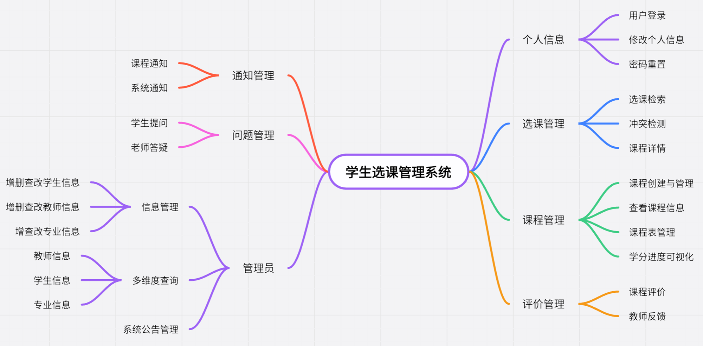
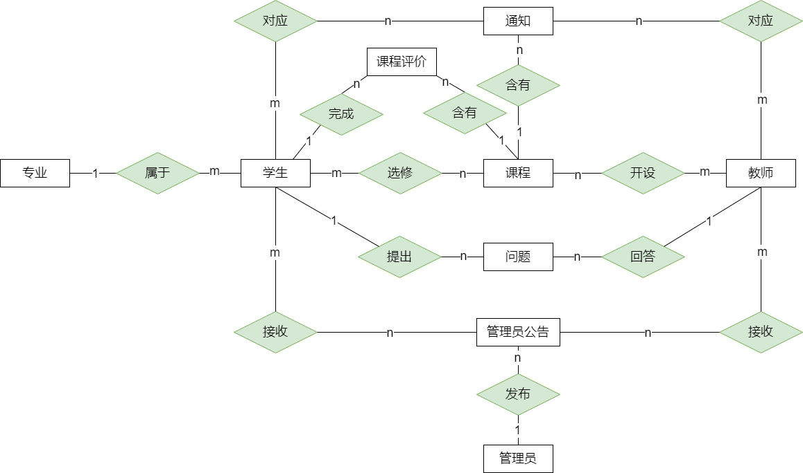
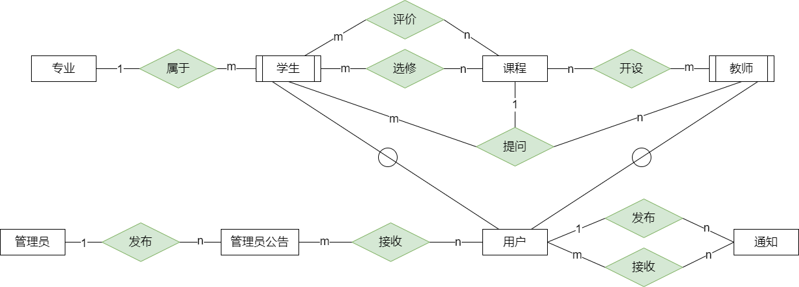

# 学生选课管理系统
###  Project setup
#### Frontend

```vue
npm install
npm run dev
```

#### Backend

```python
python manage.py runserver 8000
```

### 1. 项目说明

本项目旨在开发一个**基于** **Web** **的高校学生选课管理系统**，为学生、教师和教务管理人员提供便捷、有效的选课和课程管理平台。随着学分制的推广和教育改革的深化，选课机制的复杂性和管理难度显著增加。高效、便捷的选课管理系统可以极大地提升学生的自主选课体验，并提高学校教学管理的效率。

系统功能涵盖**学生管理**、**教师管理**、**课程管理**、**专业管理、通知管理**等模块。学生可以自主选择符合培养计划的课程，实时查看已选课程和学分进度；教师则可管理自己所授课程的选课人数，确保教学资源的合理分配。系统还支持教务人员进行用户信息管理和数据统计分析，以实现对教学资源的动态优化。

本系统的设计着眼于操作便捷和数据处理效率，具备良好的用户交互界面，并采用数据库管理学生、课程和成绩等核心数据，确保数据的准确性和一致性。通过该系统，学生能够更好地规划个人学习进度，教师与教务人员则可以实现精确、快速的管理和决策，最终提升教学质量和管理效益。


### 2. 需求及功能设计



#### 学生

-  修改个人信息。
- 选课，根据教师姓名、学院等信息筛选，可以查看老师信息、支持系统检测选课时间、容量、教室冲突。
- 管理自己的课程表。
- 可以查询已修课程，查看已修学分进度。
- 选课时可以查看课程所有评价，学生需要对课程进行打分和反馈（前端匿名），为其他同学选择课程提供更多参考。
- 具有查询课程信息和课程公告的权限。学生可以查看与自己相关的通知，确保能够及时获取课程相关的重要信息。
- 向老师提问课程相关问题，并自动通知老师。

#### 教师

-  修改个人信息。

- 创建课程，录入课程介绍、选课容量等信息，创建、修改、删除课程。

- 管理自己所教的课程表。

- 可以查询自己所教课程的学生名单信息。

- 查看学生对课程的评价，了解学生的学习反馈，可根据反馈改进教学。

- 发布课程通知，查看自己已发布的通知。

- 回答学生对课程提问，并自动通知学生。

#### 管理员

- 具有管理学生、教师、课程、专业的权限，可以检索，修改，增加，删除所有信息。
- 支持按班级、年级等条件查询学生信息，按职称、姓名等条件查询教师信息，对课程关联相应的授课教师。
- 管理每个专业的学分要求，必修课学分、选修课学分、核心专业课学分等。
- 发布系统平台通知。
- 重置学生、教师密码。


### 3. 数据流图

#### 顶层数据流图


#### 选课数据流图


#### 课程系统数据流图


#### 用户系统数据流图


#### 管理员系统数据流图


### 4. E-R 图（概念模式）

#### 初步 E-R 图



#### 基本 E-R 图



### 5. 关系模式（逻辑模式）

1. **用户**（ID，类型，姓名，性别，学院，电话，邮箱，地址，密码）

2. **学生**（ID，年级，班级，专业）

3. **教师**（ID，职称，简介）

4. **专业**（ID，名称，必修学分，选修学分，核心专业学分，一般专业学分，核心通识学分，一般通识学分）

5. **课程**（ID，名称，学分，先修课程 ID，容量，类型，类别，学期，时间，学时，教师，简介）

6. **评价**（ID，学生ID，课程ID，评分，时间，内容）

7. **问题**（ID，学生 ID，教师 ID，课程 ID，时间，提问内容，解答内容）

8. **通知**（ID，标题，发送者ID，时间，内容）

9. **公告**（ID，标题，时间，内容）

10. **课程-通知**（课程 ID，通知 ID）

11. **用户-通知**（用户 ID，通知 ID）

12. **学生-课程**（学生 ID，课程 ID，成绩）

13. **教师-课程**（教师 ID，课程 ID）

### 6. 安全性控制

1. 多角色登录（学生，教师，管理员），**权限等级**：管理员 > 教师 > 学生

2. 只有管理员能添加教师、学生账号，无法自行注册。首次登陆账号需要完善个人信息，并修改密码。

3. 采用 **JWT** 认证机制，划分管理员、教师、学生的权限，不存在跨权限调用接口问题。

4. 采用触发器来防止异常数据的产生：

  - 在插入或删除数据的时候进行检查或者修改，保证数据的完整性和正确性。

  - 删除课程的时候应该删除对应选课记录。

5. SQL 防注入